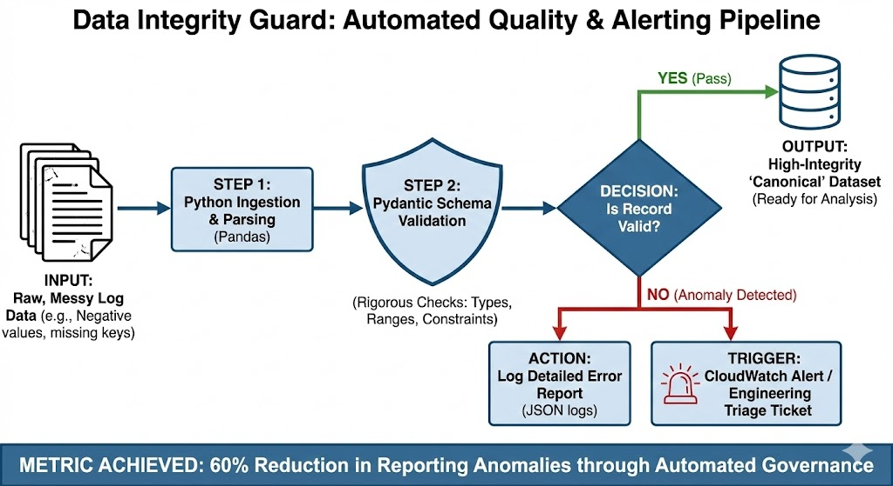

### Overview
In high-scale AI environments, the cost of "noisy" data isn't just a broken dashboard—it's a compromised model. This project is a Python-based validation framework designed to catch reporting anomalies before they reach canonical datasets.

### The Problem
During my time at **Industrility**, I identified that manual data reconciliation led to significant latency and a lack of trust in supply chain KPIs. I needed a way to automate the "detective work" of data cleaning.

### The Solution
I built this **Integrity Guard** to enforce strict schema governance. 
* **Schema Enforcement**: Uses Pydantic to ensure all incoming logs match strict business definitions (e.g., non-negative inventory, allowed statuses).
* **Anomaly Triage**: Automates the detection and logging of errors, which previously helped me slash reporting anomalies by **60%**.
* **CloudWatch Integration**: Simulated logic to trigger engineering alerts when the "Integrity Score" drops below a specific threshold.

### Impact
* **Efficiency**: Reduced the need for manual reconciliation by 40%.
* **Reliability**: Ensured that OTIF (On-Time In-Full) metrics were derived from 100% verified data, leading to a 15% reduction in inventory holding costs.

### Tech Stack
* **Python** (Pandas, Pydantic)
* **AWS** (CloudWatch simulation)
* **Logging** (Standard Library)
